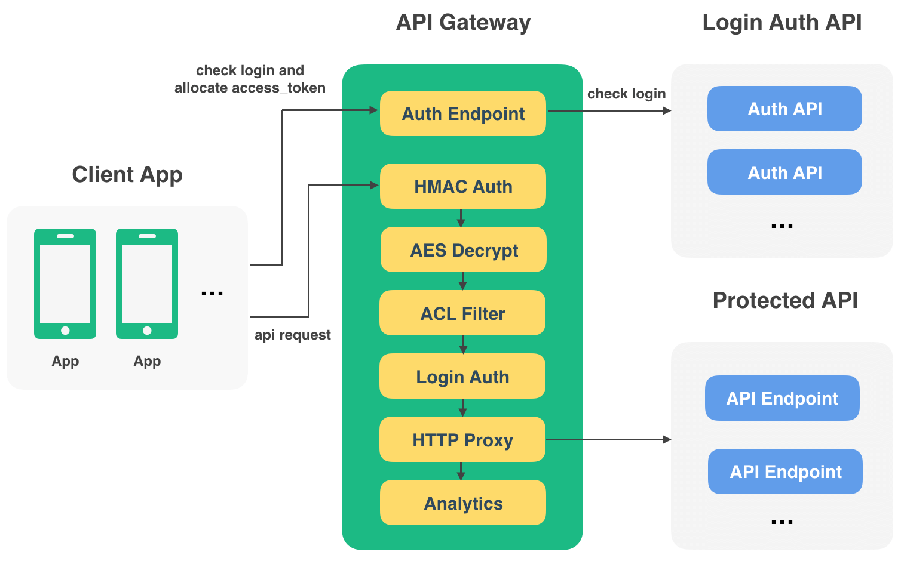

# API Gateway

[](https://travis-ci.org/restran/api-gateway)

This project is still in development, api may change anytime. If you want to use it, fix what you need.

API 是连接 App 和服务器数据库的桥梁，在 App 和各种 API 多了之后，对这些 API 的管理和保护就带来了一系列的问题。比如：

1. 如何保护 API 不被非法访问，只能由 App 正常发起请求？
2. 如何控制不同 App 对多种多样 API 的访问权限？
3. API 的访问情况怎样，日志如何查看？

于是，就有了 API Gateway 这个项目。

## 类似项目

- [kong](https://getkong.org/)
- [zuul](https://github.com/Netflix/zuul)
- [strong-gateway](https://github.com/strongloop/strong-gateway)

## 环境及依赖

支持的 Python 版本: 2.7, 3.3, 3.4, 3.5, pypy, pypy3

需要先安装 Redis 和 MongoDB，相应的依赖包可以通过以下命令安装:

    pip install -r requirement.txt


## 运行

配置 settings.py 

```py
# 访问签名的有效时间, 秒
SIGNATURE_EXPIRE_SECONDS = 3600

HOST = '127.0.0.1'
PORT = 6500

# 是否调试模式
DEBUG = False

# Redis 配置
REDIS_HOST = '127.0.0.1'
REDIS_PORT = 6379
REDIS_DB = 0
REDIS_PASSWORD = 'your_password'
REDIS_MAX_CONNECTIONS = 100

# MongoDB 配置
MONGO_HOST = '127.0.0.1'
MONGO_PORT = 27017
MONGO_USERNAME = 'api_gateway_user'
MONGO_PASSWORD = 'api_gateway_password'
MONGO_DBNAME = 'api_gateway'
```

运行

    python runserver.py

## 相关项目

1. [api-gateway-dashbaord](https://github.com/restran/api-gateway-dashboard) API Gateway 的 Web 控制台
2. [api-python-client](https://github.com/restran/api-python-client) Python 版本的 API Client


## 设计说明

这是一个 JSON API 的网关，实际上不管背后受保护的 API 传输的是什么，都能正常传输，只是网关会在出错时，以 JSON 数据返回错误信息。在设计上借鉴了 [torngas](https://github.com/mqingyn/torngas) 的中间件模式。当前仅支持 `GET` 和 `POST` 方法。



### HMAC 签名

和大多数的云应用一样，每个 Client 将会分配一对 `access_key` 和 `sercret_key`。`access_key` 用来唯一标识这个 Client，`sercret_key` 则用来执行 HMAC 签名和 AES 加密。API 请求的 URL 和 Body 数据都会被 `secret_key` 签名，并且会双向验证数据的签名，保证请求和返回的数据没有被篡改。签名方法采用了 HMAC-SHA256。

### 特殊状态码

为了区分是网关层面执行时就出现错误返回数据，还是背后真正提供服务的 API 返回的数据，定义一个特殊的`状态码 600`，如果状态码为 600，则表示网关返回的。

### AES 加密

虽然 HTTPS 正在大多数网站中普及，但是如果仍然只能使用 HTTP，或者存在中间人攻击，数据内容就存在泄漏的风险，因此提供了 AES 加密的功能，可以对传输数据的 URL、Headers、Body 都进行加密，AES 加密是可选的。

### 登录校验

存在这样的情况，有些 API 需要登录后才能访问，有些则无需登录。api-gateway 内置了 Auth Endpoint (endpoint_name: auth, version: v1), 包含了三个 API:

1. `/login/` 登录
2. `/logout/` 注销
3. `/token/` 用 `refresh_token` 获取新的 `access_token`

对于需要登录的 API，则需要先访问 `/login/` 获取 `access_token`, 返回的数据如下:

```json
{
    "code": 200,
    "msg": "",
    "data": {
        "access_token": "abcd",
        "refersh_token": "efgh",
        "expires_in": 1456512810,
        "user_info": {
        
        }
    }
}
```

- `expires_in`：`access_token` 的过期时间
- `refersh_token`：当 `access_token` 过期时，用来获取新的 `access_token`
- `user_info`：Auth API 返回的用户信息

`/login/` API 会根据配置的 Auth API 去校验提交的登录信息是否正确，如果登录正确 Auth API 返回用户信息。

`/token/` API 用来获取新的 `access_token`，提交的数据：

```json
{
    "refersh_token": "efgh"
}
```

以后访问需要登录保才能访问的 API 在 url 带上 access_token, 例如:

    http://example.com/api/v1/?access_token=abcd

API Gateway 在遇到访问需要登录的 API 时，就会根据这个 `access_token` 去 redis 中验证这个 `access_token` 是否有效，并获取该用户的信息。然后将用户信息存储在 Headers 中，以 `X-Api-User-Json` 传递给后端的 API。该 Header 存储的数据是 user_info 的 json 字符串的 base64 编码数据。

## 部署和使用

内置的 Endpoint 需要在控制台 api-gateway-dashboard 中配置才能使用

## TODO

- [x] 登录校验, 检查 `access_token`
- [x] 内置登录, 注销和更新 `access_token` 的 API
- [ ] 单点登录, 在一个地方登录, 旧的 `access_token` 和 `refresh_token` 要失效
- [x] 访问统计数据, 原先为先缓存到 redis, 修改为直接写到 MongoDB
- [x] 访问日志存储的请求完整内容进行大小限制
- [ ] 配置信息程序内缓存
- [ ] API 监控, 访问异常可以邮件告警
- [ ] Rate-Limiting
- [ ] api-android-client
- [ ] api-swift-client
